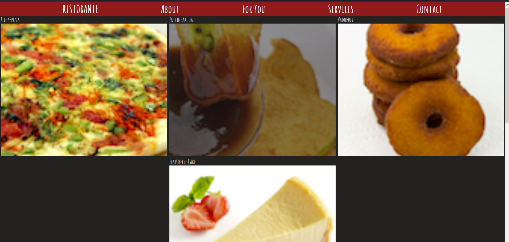
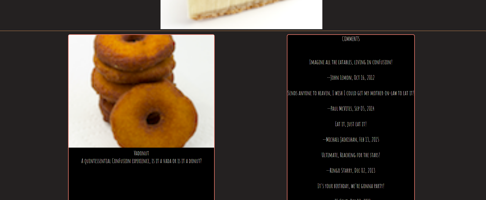

#  :yum: Indian-Restaurant-App :spaghetti:
> ristorante app gives you a small part from indian menu. You can view detai and comments also.

## Table of contents
- [hackyourweather](#hackyourweather)
  - [Table of contents](#table-of-contents)
  - [General info](#general-info)
  - [Technologies](#technologies)
  - [Features](#features)
  - [How to use](#how-to-use)
  - [Screenshots](#screenshots)
  - [Contact](#contact)

## General info
This project is a React application. It is created to sharpen the knowledge of React.js along with props and state property of React  and using local data. It is a part of assignments of The Hong Kong University Of Science - Frontend Developer Course.

## Technologies
* React.js - version 16.13.1
* Sass/Scss

## Features
* Gives the picture and the name of elements in menü
* Click on the name/photo to see details and comments

## How to use
```bash
# Clone this repository
$ git clone https://github.com/obeka/hackyourweather.git

# Go into the ristorante.app folder
$ cd ristorante.app

# Install dependencies
$ npm install

# Run the app
$ npm start
```


## Screenshots






## Contact
:mailbox_with_mail: You can send me email : ismail.bilge.de@gmail.com :mailbox_with_mail:
